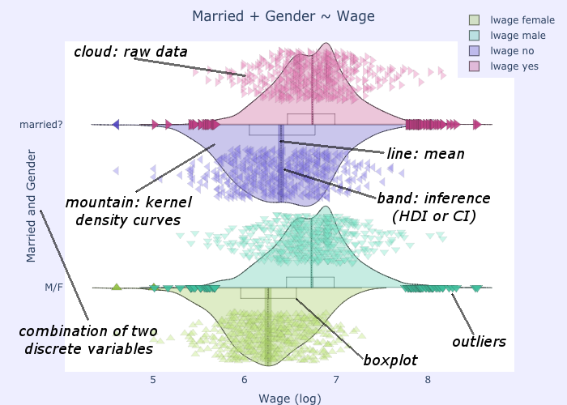

# cmplot.py - Cloudy Mountain Plot in python

[](https://travis-ci.org/g-insana/cmplot.py)
[](https://pypi.org/project/cmplot/)
[](https://cmplot.readthedocs.io/en/latest/?badge=latest)

An informative RDI categorical distribution plot inspired by Violin, Bean and Pirate Plots.

(RDI = Raw data + Descriptive statistics + Inferential statistics)

* Like [Violin plots](https://en.wikipedia.org/wiki/Violin_plot), it shows smoothed kernel density curves, revealing information which would be hidden in boxplots, for example presence of multiple *"peaks"* ("modes") in the distribution *"mountain"*.

* Like [Bean plots](https://www.jstatsoft.org/article/view/v028c01), it shows the raw data, drawn as a *cloud* of points. By default all data points are shown but you can optionally control this and limit the display to a subset of the data.

* Like [Pirate plots](https://github.com/ndphillips/yarrr), it marks confidence intervals (either from Student's T or as Bayesian Highest Density Intervals or as interquantile ranges) for the probable position of the true population mean.

Since by default it does not symmetrically mirror the density curves, it allows immediate comparisions of distributions side-by-side.



The plotting function comes with a large number of options, allowing full customization of the results. On the other hand it is also automatic enough to be able to work with only two arguments: a dataframe and the label/symbol of the dataframe column containing your X (the categorical data).

## Documentation

Please refer to the [online documentation at readthedocs.io](https://cmplot.readthedocs.io)

## Download and installation

`cmplot` is pure python code. It has no platform-specific dependencies and should thus work on all platforms. It requires the packages `plotly numpy scipy pandas`. The latest version of `cmplot` can be installed by typing either:

``` bash
pip3 install --upgrade cmplot
```
  (from [Python Package Index](https://pypi.org/project/cmplot/))

or:
``` bash
pip3 install git+git://github.com/g-insana/cmplot.py.git
```
  (from [GitHub](https://github.com/g-insana/cmplot.py/)).

There is also a [version in Julia](https://github.com/g-insana/CMPlot.jl/).

## Tutorial

Check the [jupyter notebook](cmplot_python3_with_examples.ipynb) for usage and examples. You can use the jupyter notebook for fast experimentation or download the module and use it in your data mining and data visualization projects.
Note: if the version on github is not rendering properly, try [this one, via nbviewer.jupyter.org](https://nbviewer.jupyter.org/github/g-insana/cmplot.py/blob/master/cmplot_python3_with_examples.ipynb).

## Quickstart

``` python
>>> import plotly.graph_objects as go
>>> from cmplot import cmplot

 #call the cmplot directly inside a plotly Figure function as:

>>> go.Figure(*cmplot(mydataframe,xcol="xsymbol"))

 #alternatively get traces and layout as separate variables, so that you can modify them or combine with others before passing them to Figure() function:

>>> (traces,layout)=(cmplot(mydataframe,xcol="xsymbol"))

 #[...] do something with traces/layout

>>> go.Figure(traces,layout) #plot it
```

## Arguments/Options

The only mandatory arguments for `cmplot` are a dataframe containing the data and either a string or a list of strings which label the columns containing the discrete independent variables in the dataframe, as shown above in the Quickstart section.

Several additional optional arguments can be specified to customize the result, both in terms of content and of form.

* `xcol`: a string or an array of strings, column name(s) of the dataframe that you wish to plot as "x".

This should be the categorical independent variable. If more than one column name is given, the combination of these will be used as "x". See examples for interpretation.
e.g. `xcol="Species"`

* `ycol`: a string or an array of strings, column name(s) of the dataframe that you wish to plot as "y". Optional.

These should be the continuous dependent variables. If ycol is not specified, then the function will plot all the columns of the dataframe except those specified in `xcol`.

e.g. `ycol=["Sepal.Length","Sepal.Width"]` would plot sepals' length and width as a function of the flower species

* `orientation`: 'h' | 'v', default is 'h'

Orientation of the plot (horizontal or vertical)

* `xsuperimposed`: boolean, default is False

The default behaviour is to plot each value of the categorical variable (or each combination of values for multiple categorical variables) in a separate position. Set to True to superimpose the plots. This is useful in combination with "side='alt'" to create asymmetrical plots and comparing combinations of categorical variables (e.g. Married + Gender ~ Wage).

* `xlabel`: string or list of strings

Override for labelling (and placing) the plots of the categorical variables. Only relevant when using `xsuperimposed`

* `title`: string

If not specified, the plot title will be automatically created from the names of the variables plotted.

e.g. `title="Length of petals for the three species"`

* `side`: 'pos' | 'neg' | 'both' | 'alt', default is 'alt'

'pos' would create kernel density curves rising towards the positive end of the axis, 'neg' towards the negative, 'both' creates symmetric curves (like violin/bean/pirate plots). 'alt' will alternate between 'pos' and 'neg' in case where multiple ycol are plotted.

e.g. `side='both'`

* altsidesflip: boolean, default is False

Set to True to flip the order of alternation between sides for the kernel density curves. Only relevant when `side`='alt'

* `ycolorgroups`: boolean, default is True

Set to False to have the function assign a separate colour when plotting different values of the categorical variable. Leave as True if all should be coloured the same.

* `pointsoverdens`: boolean, default is False

Set to True to plot the raw data points over the kernel density curves. This is obviously the case when `side`='both', but otherwise by default points are plotted on the opposite side.

* `showpoints`: boolean, default is True

Set to False to avoid plotting the cloud of data points

* `pointsopacity`: float, range 0-1, default is 0.4

The default is to plot the data points at 40% opacity. 1 would make points completely opaque and 0 completely transparent (in that case you'd be better served by setting `showpoints` to False).

* `inf`: 'hdi' | 'ci' | 'iqr' | 'none', default is 'hdi'

To select the method to use for calculating the confidence interval for the inference band around the mean. 'hdi' for Bayesian Highest Density Interval, 'ci' for Confidence Interval based on Student's T, 'iqr' for Inter Quantile Range. Use 'none' to avoid plotting the inference band.

* conf_level: float, range 0-1, default is 0.95

Confidence level to use when `inf`='ci', credible mass for `inf`='hdi'

* hdi_iter: integer, default is 10000

Iterations to use when performing Bayesian t-test when `inf`='hdi'

* showboxplot: boolean, default is True

Set to False to avoid displaying the mini boxplot

* markoutliers: boolean, default is True

Set to False to avoid marking the outliers

* pointshapes: array of strings

You can specify manually which symbols to use for each distribution plotted. If not specified, a random symbol is chosen for each distribution.

* pointsdistance: float, range 0-1, default is 0.6

Distance at which data points will be plotted, measured from the base of the density curve. 0 is at the base, 1 is at the top.

* pointsmaxdisplayed: integer, default is 0

This option sets the maximum number of points to be drawn on the graph. The default value '0' corresponds to no limit (plot all points). This option can be useful when the data amount is massive and would prove inefficient or inelegant to plot.

* colorrange: integer, default is None

By default, the distribution will be coloured independently, with the colours automatically chosen as needed for a single plot, maximising the difference in hue across the colour spectrum. You can override this by specifying a number to accomodate. This is useful when joining different plots together. E.g. if the total number of colours to be accomodating, after joining two plots, would equal 4, then set colorrange=4

* colorshift: integer, default is 0

This option is used in combination with `colorrange` to skip a certain amount of colours when they are to be assigned to the distributions to be plotted. This is useful when joining different plots together, to avoid having distributions plotted with the same colour.

## References

* Hintze, J. L., Nelson, R. D. (1998). Violin plots: A box plot-density trace synergism. The American Statistician 52, 181–184.
* Kampstra, P. (2008). Beanplot: A boxplot alternative for visual comparison of distributions. Journal of Statistical Software 28, 1–9.
* Phillips, N. (2017). YaRrr! The pirate's guide to R. The Observer.

## Copyright

`cmplot` is licensed under the [GNU Affero General Public License](https://choosealicense.com/licenses/agpl-3.0/).

(c) Copyright [Giuseppe Insana](http://insana.net), 2019-
